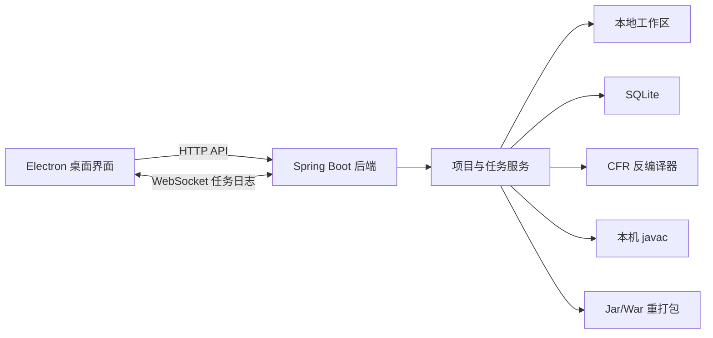

# JarPatch Studio 项目现状分析与补充建议

## 1. 分析结论

JarPatch Studio 已经完成第一版核心业务闭环，不是只有界面和工程骨架的半成品。目前源码已经覆盖：Jar/War 预解析、工作区导入、CFR 反编译、文件查看与编辑、全文搜索、结构分析、JDK 配置、Java 编译、class 写回、重新打包、任务日志、任务取消和 SQLite 历史记录。

当前更准确的产品阶段是：**可继续开发和进行受控手工验收的功能原型，但还不适合直接作为稳定发布版交付。**

原因不是核心功能缺失，而是以下发布级闭环尚未补齐：

1. 本地后端访问边界过宽，存在被其他网页或局域网设备调用的风险。
2. 编译没有按原包 Java 字节码版本控制输出，可能把旧项目误编译成 Java 17 字节码。
3. 导入、分组编译和导出不是完整原子操作，失败或取消时可能留下半成品状态。
4. 编译前会自动改写反编译源码，存在产品通用性和源码保真风险。
5. 导出前差异确认、签名处理策略和导出后结构校验尚未形成闭环。
6. 大包资源限制、安装包、跨平台启动、真实样本验收记录仍未完成。

建议先完成本文 P0 事项，再继续增加一般性功能。

## 2. 本次分析范围与验证边界

### 2.1 已检查内容

- `readme.md`、`PLAN.md` 和现有设计说明。
- 54 个后端 Java 源文件及其调用关系。
- Electron 主进程、预加载脚本、渲染层、页面和样式文件。
- Maven、npm、Spring Boot、SQLite 和启动脚本配置。
- 最近 3 次 Git 提交及当前工作区状态。
- 核心服务复杂度、热点方法、路径安全和任务状态流转。

### 2.2 已实际验证

- 使用 PowerShell 7 和 `C:\Program Files\Java\jdk-17` 执行后端 Maven 构建。
- 执行命令：`mvn.cmd "-Dmaven.test.skip=true" package`。
- 54 个 Java 源文件编译成功，Maven Reactor 构建结果为 `BUILD SUCCESS`。
- 生成 `backend/target/jarpatch-studio-backend.jar`，大小约 36.1 MiB。
- 可执行包内已确认包含：
  - `META-INF/MANIFEST.MF`
  - `BOOT-INF/classes/com/jarpatch/JarPatchStudioApplication.class`
  - `BOOT-INF/lib/cfr-0.152.jar`
- 构建前 Git 工作区为干净状态。

### 2.3 本次未验证

- 未使用真实普通 Jar、Spring Boot Jar、War 完整执行导入到导出的端到端流程。
- 未验证签名 Jar、多版本 Jar、混淆包和超大包。
- 未启动 Electron 做前端页面手工验收；按项目约定，本次不做前端测试。
- 未验证 Windows 安装包、Mac 和 Linux 交付。
- 未新增自动化测试用例。

因此，本文中的“已完成”表示源码和调用链已落地；只有后端构建结果属于本次实际运行验证。真实包处理效果仍需样本验收确认。

## 3. 当前架构与主流程

主业务链路如下：

1. Electron 选择 Jar 或 War。
2. `/api/projects/inspect` 预解析包类型、`pom.xml` 模块和嵌套 Jar。
3. 用户确认需要反编译的嵌套 Jar。
4. `/api/projects/import` 创建工作区、复制原包、解压、识别类型、调用 CFR 并记录项目历史。
5. 用户通过文件树查看、搜索、编辑并保存源码或资源。
6. `/api/projects/{id}/analyze` 返回 Manifest、入口类、依赖、修改文件和风险信息。
7. `/api/projects/{id}/compile` 调用配置的或自动发现的 `javac`，将 class 写回主目录或嵌套 Jar。
8. `/api/projects/{id}/export` 重新打包并记录导出路径。
9. 导入、分析、编译、导出过程通过任务表和 WebSocket 提供进度与取消能力。

整体分层清楚，前端、控制器、服务、仓储和工作区职责已经形成。当前主要问题集中在边界安全、失败一致性、通用算法和发布验证，而不是缺少基础架构。

## 4. 已完成内容盘点

| 模块 | 当前状态 | 已完成内容 | 仍有边界 |
| --- | --- | --- | --- |
| 工程骨架 | 已完成 | Maven 聚合工程、Java 17 Spring Boot 后端、Electron 前端、Apache-2.0 许可证 | 尚无正式桌面发布配置 |
| 导入前预解析 | 已完成 | 识别 Jar/War、读取 `pom.xml` 模块、生成嵌套 Jar 候选项和推荐项 | 缺少大包限制和恶意压缩包约束 |
| 项目导入 | 基本完成 | 创建独立工作区、复制原包、解压、识别包类型、写入 SQLite | 导入失败时项目记录和工作区缺少统一回滚 |
| 反编译 | 基本完成 | CFR 接入、主 classes 反编译、选择性嵌套 Jar 反编译、跳过 `module-info.class` | 单个 CFR 调用期间取消粒度有限，真实复杂样本未验收 |
| 文件树 | 已完成 | 展示 `sources` 和 `extracted`，前端缓存并支持目录展开和宽度拖拽 | 超大目录仍一次返回完整树 |
| 文件编辑 | 基本完成 | Java 和白名单文本资源读取、UTF-8 保存、修改路径写入 `file_changes` | 没有未保存提醒、版本快照和内容哈希；Unicode 展示转换可能被保存回文件 |
| 项目搜索 | 已完成 | 文件名和内容搜索、中文 Unicode 转义展示、定位行号、结果数量限制 | 当前按整文件读取，缺少文件大小限制、分页和取消 |
| JDK 配置 | 基本完成 | 设置弹窗、目录选择、`javac` 路径校验、SQLite 保存、编译优先使用 | 只验证文件存在，没有执行 `javac -version` 和兼容性检查 |
| 结构分析 | 已完成 | Manifest、入口类、布局、class 数、依赖、修改文件、签名、多版本和混淆风险 | 分析结果未持久化，风险没有进入强制导出门禁 |
| Java 编译 | 基本完成 | `javac @参数文件`、长 classpath 处理、主源码和嵌套 Jar 分组写回、取消时终止 javac | 未按原包字节码版本编译；存在自动改源码和分组部分成功风险 |
| Jar/War 导出 | 基本完成 | 普通 Jar、Spring Boot Jar、War 重打包；Spring Boot 嵌套 Jar 使用 STORED；记录导出路径 | 无差异确认、原包覆盖保护、原子输出和导出后校验 |
| 任务机制 | 基本完成 | 任务预创建、状态、进度、WebSocket 日志、取消入口、javac 强制终止 | 更新存在并发覆盖窗口，历史日志未独立持久化，进程崩溃后的 RUNNING 状态未恢复 |
| SQLite | 基本完成 | `projects`、`tasks`、`file_changes`、`export_records`、`app_settings` 5 张表 | 没有正式迁移机制、外键和常用查询索引 |
| 项目历史 | 已完成 | 项目列表和关联历史删除，使用事务且不会误删工作区 | 缺少单独、可预览的工作区清理能力 |
| 桌面交互 | 已完成第一版 | 提示、底部日志、任务栏、风险侧栏、配置弹窗、只读提示、菜单隐藏 | 仍是基础 `textarea` 编辑器，没有脏状态、撤销保护和多文件标签 |
| Windows 启动 | 部分完成 | 能检查 Java、npm、Maven、前端依赖和 CFR 是否进入后端包 | 脚本仍调用 Windows PowerShell 5.1，文件名带历史日期，且缺少后端就绪检查 |
| 项目文档 | 基本完成 | 功能、接口、流程、常见问题和路线图较完整 | 路径、表数量、启动命令和完成状态存在过期内容 |

## 5. 已有路线图中确认尚未完成的内容

以下内容在 `readme.md` 和 `PLAN.md` 中已提出，源码核对后确认仍需要补齐：

1. 导出前差异对比：源码差异、资源差异、待写回 class 清单。
2. 导出后结构校验：Manifest、Spring Boot 嵌套 Jar 压缩方式、War 目录、修改文件和目标 class。
3. 独立工作区清理：与“删除历史”分开，先预览再确认。
4. 项目级设置：默认导出目录、推荐嵌套 Jar 默认选择、界面偏好等。
5. 错误排查向导：JDK、CFR、编译、签名、路径过长、端口冲突等。
6. Mac/Linux 启动和打包脚本。
7. Windows 安装包或免安装发布包。
8. 普通 Jar、复杂 Spring Boot Jar、War、签名包、多版本 Jar、混淆包的真实验收记录。

其中实时任务日志、任务取消、二进制/签名文件只读提示和 JDK 配置已经完成，不应继续作为“未完成事项”重复列出。

## 6. 新发现的高优先级补充项

### 6.1 P0：收紧本地后端访问边界

当前 `application.yml` 只配置端口，没有把后端限制在 `127.0.0.1`；Spring Boot 默认可能监听所有网卡。`CorsConfig` 对 `/api/**` 使用 `allowedOriginPatterns("*")`，WebSocket 也允许所有来源。

这是桌面本地工具仍需要重视的风险：恶意网页或同网段设备可能尝试调用本机接口，而当前导入和导出接口能接收本地绝对路径。

建议：

1. 后端明确绑定 `127.0.0.1`。
2. HTTP 和 WebSocket 不再使用 `*`，只允许桌面端实际使用的来源。
3. Electron 启动后端时生成一次性随机令牌，通过进程参数或环境变量传入后端；所有 API 和 WebSocket 都验证令牌。
4. WebSocket 建连时验证任务 ID 是否存在且属于当前实例。
5. 端口被占用时不能直接连接未知进程，应完成产品标识和令牌握手。

### 6.2 P0：保证导出不会覆盖原包，也不会留下半个包

`ExportService.resolveOutputPath` 接受任意绝对路径，没有禁止选择原始 Jar/War；`ArchiveService.zipDirectory` 直接打开最终输出文件写入。失败、取消或用户误选原路径时可能破坏文件。

建议采用严格原子流程：

1. 解析并比较原始包、工作区原包和输出包的规范化真实路径。
2. 明确禁止覆盖输入原包和工作区 `original` 文件。
3. 在输出文件同目录创建唯一临时文件。
4. 完整写入并完成结构校验后，再使用原子移动替换最终目标。
5. 失败或取消只删除本次临时文件，不影响既有输出。

### 6.3 P0：按原包 Java 版本编译

当前 `javac` 参数只有编码、classpath 和输出目录，没有 `--release`、`-source` 或 `-target`。因此使用 JDK 17 修改 Java 8/11 包时，生成的 class 可能只能在 Java 17 运行。

建议：

1. 导入时读取主业务 class 的 major version，并识别多版本 Jar 的版本目录。
2. 项目记录中保存检测到的目标 Java 版本和检测依据。
3. 保存 JDK 配置时实际执行 `javac -version`，而不是只检查文件存在。
4. 编译时使用与目标版本匹配的 JDK 和 `--release`。
5. 目标版本不一致时阻止编译并给出明确原因，不自动降级或猜测。

### 6.4 P0：移除编译前的业务特定源码改写

`CompileService` 当前在执行 `javac` 前直接改写 `sources` 文件，自动删除重复注解和 `CommonResult.success(...)` 外层 `(Object)`。其中 `CommonResult` 是特定项目类型，不属于通用 Jar 修复算法；基于字符串和括号扫描的改写也可能误处理注释、文本块、复杂泛型或同名类型。

这与通用工具“保留用户源码、禁止启发式补丁”的目标冲突。

建议：

1. 编译默认只读取用户保存的源码，不自动改写源码文件。
2. CFR 输出无法编译时，原样返回 javac 诊断并定位行号。
3. 如果未来确需源码变换，只允许基于 Java AST 和类型解析的通用规则，并必须先展示差异、由用户明确确认。
4. 不保留 `CommonResult` 这类业务框架专用处理。

### 6.5 P0：保证读取和保存的源码完全一致

`FileContentService.read` 会把部分 `\uXXXX` 中文转义解码后返回前端，用户即使只打开再保存，也可能把展示内容写回文件。`JavaUnicodeEscapeService` 也没有基于完整 Java 词法上下文判断转义用途。

建议：

1. 编辑器默认展示并保存原始文本，做到未修改保存时字节内容不变化。
2. 如果需要中文友好展示，增加只读“转义预览”开关，预览值不能直接覆盖原文本。
3. 文件保存前比较原始内容和编辑内容，没有变化时不写文件、不记录修改。
4. 为资源文件保留原始编码和换行符信息，不统一假定所有文本都能安全重写为 UTF-8。

### 6.6 P0：导入和编译过程增加提交阶段

当前导入在 CFR 完成前就插入 `projects`；失败后没有删除不完整记录和工作区。编译按目标分组后逐组写回，如果后面的目标失败，前面的目标已经修改 `extracted` 或嵌套 Jar。

建议：

1. 导入先在临时工作区完成复制、解压、识别和反编译，全部成功后再移动为正式工作区并写项目记录。
2. 或为项目增加明确状态，但不能把失败项目展示为可正常编辑项目。
3. 编译先把全部目标输出到 staging 区并完成校验，全部成功后再统一写回。
4. 写回前生成文件清单和哈希；写回失败时从本次备份恢复。

### 6.7 P0：增加压缩包资源限制

项目已经通过 `safeResolve` 防止 Zip 路径逃逸，这是正确的；但目前没有限制压缩包大小、条目数、总解压大小、压缩比和目录深度。Spring Boot 嵌套 Jar 导出时还会使用 `Files.readAllBytes` 计算 CRC，大文件会直接占用等量内存。

建议：

1. 导入预解析和解压共享统一的资源限制配置。
2. 在解压过程中累计条目数和实际输出字节数，超过限制立即失败。
3. 检查异常压缩比、重复条目、路径深度和单文件大小。
4. CRC 使用流式读取，不把整个嵌套 Jar 一次读入内存。
5. 所有限制值进入配置和界面说明，不在方法体中散落魔法数字。

### 6.8 P0：建立签名包和导出校验门禁

当前分析能提示签名风险，但不会阻止导出，也不会提供明确的签名处理策略。修改后继续保留原签名文件通常会导致校验失败。

建议：

1. 导出前必须执行分析，检测签名、多版本和包布局。
2. 签名包必须让用户选择明确策略：保持原样并阻止修改、按规范移除失效签名后导出未签名包，或使用用户提供的签名配置重新签名。
3. 导出后检查 Manifest、入口类、修改资源、目标 class、嵌套 Jar 压缩方式和包可读取性。
4. 校验失败时不发布最终文件，只保留可诊断的任务结果。

## 7. P1 功能与稳定性补齐

### 7.1 差异与版本基线

当前 `file_changes` 只记录路径和类型，没有原始内容、修改内容或哈希，无法可靠生成差异、判断文件是否真正变化或恢复修改。

建议为每个可编辑文件建立导入基线，至少记录原始哈希、当前哈希、首次修改时间和最后修改时间；源码和资源差异统一从基线计算。恢复功能应从明确基线恢复，不能重新猜测或重新反编译替代。

### 7.2 任务状态并发与恢复

`TaskService.update` 先读取最新状态，再执行普通 `UPDATE`。取消请求可能在读取和写入之间发生，后一次 RUNNING/SUCCESS 更新仍有覆盖 CANCELED 的窗口。

建议：

1. 仓储层使用带条件的状态更新，例如只在数据库当前状态为 RUNNING 时更新。
2. 检查受影响行数，状态已变化时停止当前流程。
3. 后端启动时把遗留 RUNNING 任务标记为“进程异常中断”，不能永远显示执行中。
4. 任务日志单独持久化，避免当前 `message` 只能保存最后一条信息。

### 7.3 数据库迁移和索引

当前 `DatabaseInitializer` 仅使用 `CREATE TABLE IF NOT EXISTS`，适合首次建库，但无法可靠演进已有数据库结构。

建议：

1. 引入顺序明确、可重复校验的 SQLite 迁移机制。
2. 为 `tasks.project_id`、`file_changes.project_id`、`export_records.project_id` 和时间排序字段补索引。
3. 在 SQLite 支持范围内建立外键并启用外键检查。
4. 把分析报告、任务日志、目标 Java 版本和导出校验结果纳入正式数据模型。

### 7.4 后端启动生命周期

Electron 当前调用 `java -jar` 后立即创建窗口，没有等待后端就绪，标准输出和错误被忽略；固定端口被占用时也没有确认占用者身份。

建议：

1. 使用明确的 Java 可执行路径启动后端，并记录子进程 PID。
2. 后端增加本机健康检查和实例标识接口。
3. Electron 等待健康检查成功后再开放工作台。
4. 启动失败时展示后端日志，而不是忽略标准错误。
5. 正常退出先请求后端停止，再在超时后终止本实例子进程。

### 7.5 编辑器脏状态保护

当前切换文件、切换项目或关闭窗口时，没有判断编辑器内容是否尚未保存，用户输入可能直接丢失。

建议增加原始内容快照、脏标记、保存快捷键、切换确认和关闭确认。未保存内容不得自动丢弃。

### 7.6 工作区清理和项目设置

工作区清理应继续遵循“预览后确认”：先展示项目、路径、文件数、大小和最后使用时间，再由用户确认删除。删除历史和删除工作区必须是两个独立动作。

项目级设置建议优先包括目标 Java 版本、默认导出目录、嵌套 Jar 选择、文件大小限制和界面偏好；不能只依赖全局 JDK 设置。

## 8. P2 维护性和性能优化

### 8.1 拆分大文件职责

当前主要大文件为：

- `CompileService.java`：861 行。
- `ArchiveService.java`：442 行。
- `ProjectInspectionService.java`：399 行。
- `renderer.js`：1201 行。
- `styles.css`：889 行。

建议按真实职责拆分，而不是机械按行数拆分：

- 编译：目标版本检测、classpath 构建、javac 执行、编译产物提交。
- 归档：安全读取、解压限制、嵌套 Jar 更新、最终打包、结构校验。
- 前端：API 客户端、任务会话、项目列表、文件树、编辑器、分析、设置。

拆分后保持现有接口合同不变，避免一次性大重构。

### 8.2 大项目性能

建议逐步处理以下热点：

1. 搜索由 `Files.readAllLines` 改为流式逐行读取，并在达到结果上限后停止遍历。
2. 文件树改为按目录懒加载，避免后端一次构造完整树。
3. 反编译减少逐 class 启动 CFR 主入口的重复成本，优先使用 CFR 支持的批量输入机制。
4. 打包不要同时把全目录路径和大文件内容完整放入内存。
5. 搜索、分析、文件树和导入都增加统一取消与进度口径。

### 8.3 桌面发布和依赖治理

1. 先完成 Windows 免安装包或安装包，并把后端 JRE、后端 Jar、Electron 资源统一纳入版本清单。
2. 再补 Mac/Linux 启动和签名发布，不把“Electron 可跨平台”等同于“已经跨平台交付”。
3. 固定 Node.js、npm 和 Electron 版本，建立依赖升级和安全审查记录。
4. 为发布产物生成版本号、SHA-256、构建环境和手工验收清单。

## 9. 现有实现值得保留的点

以下设计方向是正确的，后续优化应保持：

- `ArchiveService.safeResolve` 和 `WorkspaceService.resolveInside` 已做规范化路径边界检查。
- Electron 已启用 `contextIsolation: true` 并关闭 `nodeIntegration`。
- Java 编译使用标准 `@参数文件`，规避 Windows 命令行长度限制。
- 取消编译时会主动终止 `javac` 子进程。
- Spring Boot 嵌套 Jar 导出时按 STORED 条目处理。
- 删除项目历史使用事务，且明确不删除工作区文件。
- Java 类整体已补充职责说明、调用关系和 `@author 黄杰`。
- 业务状态已有枚举，常用路径、扩展名和部分文案已集中到常量。
- 前端对来自文件名、路径、搜索结果和风险详情的动态 HTML 基本做了转义。

## 10. 文档和脚本需要同步纠正的内容

1. `readme.md` 和 `PLAN.md` 仍出现旧目录 `D:\code\JavaHot` 与 `JavaHot/`，应改为当前稳定项目名和相对路径说明。
2. README 原先只写 4 张 SQLite 表，实际还有 `app_settings`。
3. README 的后续路线图仍把已经完成的实时日志、取消和只读提示列为待办，应改为完成记录。
4. Windows 固定启动入口不应继续使用日期文件名，建议迁移为稳定的 `start-jarpatch-studio.cmd`，并更新所有引用。
5. 启动脚本第 35 行仍调用 `powershell`，应统一改为 PowerShell 7 的 `pwsh.exe`，执行前验证主版本不小于 7，禁止降级到 Windows PowerShell 5.1。
6. PowerShell 文档中的 Maven 参数应作为独立引号参数，例如 `mvn.cmd "-Dmaven.test.skip=true" package`。
7. README 底部长期保存单次 Git Commit 信息容易过期，提交信息应在每次交付结果中提供，不应作为长期说明书内容。
8. 页面没有 CSP。虽然当前动态内容大多已转义，仍建议增加严格 CSP 并继续保持 `textContent`/显式转义策略。

## 11. 建议实施顺序

| 阶段 | 目标 | 完成门槛 |
| --- | --- | --- |
| 第一阶段 | 安全与数据保护 | 后端仅本机可访问；令牌握手完成；禁止覆盖原包；导入、编译、导出失败不留下半成品 |
| 第二阶段 | 编译和源码保真 | 识别目标 Java 版本；严格使用匹配 JDK/`--release`；移除业务特定源码改写；未修改保存不改变文件 |
| 第三阶段 | 差异和导出闭环 | 有可靠基线和差异视图；签名策略明确；导出后自动结构校验；校验失败不发布目标文件 |
| 第四阶段 | 数据与运行稳定性 | 数据库迁移、索引、任务条件更新、崩溃恢复、持久化日志、后端健康检查完成 |
| 第五阶段 | 产品化交付 | 工作区清理、项目设置、错误向导、Windows 发布包和真实样本验收完成 |
| 第六阶段 | 跨平台与持续优化 | Mac/Linux 交付、性能优化、依赖治理和发布清单完成 |

## 12. 下一里程碑建议

下一里程碑不要定义为“再增加几个按钮”，建议定义为：

> 使用一个 Java 8 普通 Jar、一个 Java 17 Spring Boot Jar 和一个 War，在不覆盖原包的前提下完成导入、编辑、编译、差异确认、导出和自动结构校验；任一步失败或取消都不会留下可被误认为成功的项目、class 或输出包。

达到这个门槛后，JarPatch Studio 才从“功能原型”进入“可控使用版”。完成签名包、多版本 Jar、混淆包、大包限制、安装包和更多真实验收后，再进入正式发布阶段。

## 13. 2026-08-10 六阶段实施结果

本次已按第 11 节顺序完成六个阶段。实现过程中保持原接口主流程，未新增自动化测试用例，采用后端构建、真实样本业务验收和正式发布包校验作为完成证据。

| 阶段 | 实施结果 | 验证结果 |
| --- | --- | --- |
| 第一阶段 | 仅监听本机；随机令牌和实例 ID 保护 HTTP/WebSocket；禁止覆盖原包；导入采用 `.importing`/`.ready` 状态机；编译 staging 回滚；导出同目录临时文件原子发布 | 无令牌 HTTP 401；连续三轮导入闭环通过；失败路径不写项目记录或目标包 |
| 第二阶段 | 从原始 class major version 识别 Java 目标版本；验证实际 javac；严格使用 `--release`；移除业务特定源码改写；保存保留编码/BOM/换行并用哈希防覆盖 | Java 8 与 Java 17 样本分别识别并编译成功；未修改保存不写文件 |
| 第三阶段 | 固定导入基线、源码/资源/hash/class 差异；签名保留/移除门禁；导出后校验 Manifest、布局、资源、class、嵌套 Jar 和签名 | 普通 JAR、Spring Boot JAR、WAR 导出校验均通过；签名风险识别通过 |
| 第四阶段 | SQLite 顺序迁移、外键索引、条件任务更新、遗留任务/导入工作区恢复、持久化日志、健康检查和安全退出 | 每个端到端任务持久化 5 条日志；退出后端口释放 |
| 第五阶段 | 工作区预览确认清理、项目设置、六类错误向导、Windows 免安装包和六类真实样本 | 3 个端到端样本、3 个风险样本连续三轮通过 |
| 第六阶段 | macOS/Linux 稳定启动与原生打包入口；流式搜索/遍历/归档；Node/npm/Electron/Maven 插件锁定；跨平台统一 SHA-256 清单和发布门禁 | Windows 发布包实际生成并复算哈希一致；macOS/Linux 保留原生主机验收边界 |

Windows 最终发布包为 `release/windows/JarPatch-Studio-0.1.0-Windows-x64.exe`，大小 151316178 字节，SHA-256 为 `75044a990beb0f7af1f21392ae4ca5e0a5dd4877313d99dbdc7d728019d3eb7e`。完整证据见 `docs/2026-08-10-acceptance-report.md`，持续发布步骤见 `docs/release-checklist.md`。
