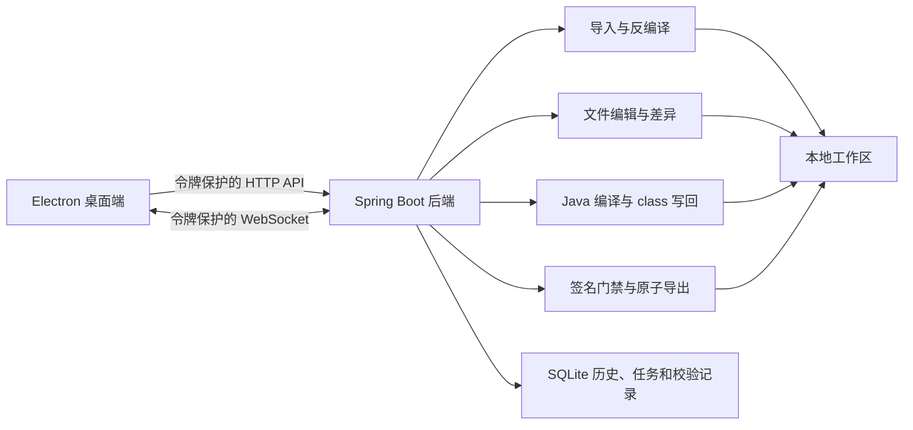

# JarPatch Studio 当前完成度与进阶优化分析

## 1. 当前结论

JarPatch Studio 已经完成第一版核心业务闭环和主要发布级保护，不再是功能原型。当前更准确的产品阶段是：

> **Windows 可控内部使用版；跨平台公开发布版尚未完成。**

普通 JAR、Spring Boot JAR、WAR 已具备导入预解析、分批反编译、懒加载文件树、源码与资源编辑、目标 Java 版本编译、差异确认、签名门禁、结构校验和流式原子导出的完整链路。仅本机访问、令牌握手、失败回滚、任务恢复、滚动日志、诊断导出、显式旧编码、历史时间线、孤立工作区清理和发布清单等发布级能力也已经落地。

本文第一至第四阶段的开发与本机验证已经完成；第五阶段的构建、签名、公证、验收和回滚入口已经完成，但正式签名与 macOS/Linux 原生验收仍需要组织证书和对应原生主机。

## 2. 本次分析范围与证据

本次基于 `main` 分支当前开发工作区、项目文档、构建配置、发布目录和代码知识图谱完成分析、开发与复验。

- 当前提交：`f188ff855f9666c007d4051fd6cba90fa432f77a`，提交时间为 2026-08-11 21:58:46（中国时区）。
- 开发后工作区：包含本轮未提交改动，发布清单如实记录 `sourceClean: false`。
- 数据库：新增项目默认编码、文件变更编码和操作时间线迁移，启动专项验证已完成真实迁移和读写。
- 当前构建：使用 PowerShell 7.6.4、JDK 17.0.12 执行 Maven 完整打包，结果为 `BUILD SUCCESS`。
- 静态检查：前端主进程、预加载、API 客户端、渲染器、版本同步和清单生成脚本均通过 `node --check`；PowerShell 与 Bash 发布脚本通过语法检查；`git diff --check` 通过。
- 后端包检查：`backend/target/jarpatch-studio-backend.jar` 是 Spring Boot 可执行包，包含 `BOOT-INF/lib/cfr-0.152.jar`。
- 端到端验收：Java 8 普通 JAR、Java 17 Spring Boot JAR、Java 8 WAR 及签名、多版本、混淆风险样本全部通过。
- 大包基准：1 万、5 万、20 万条目均完成导入、懒加载、搜索、编译和导出实测。
- Windows 包：当前工作区重新生成 0.1.0 x64 免安装包，解包应用冒烟通过，SHA-256 复算一致，签名状态为 `NOT_SIGNED`。

本次没有执行 Electron 页面手工测试，按项目约定由用户自行验证前端界面；也没有在 macOS/Linux 原生主机执行构建和启动验收。本文继续把“本机已验证”和“需要外部条件的正式发布门禁”分开表述。

## 3. 当前架构与核心流程

核心链路如下：

1. Electron 选择 JAR/WAR，后端只预解析包类型、`pom.xml` 模块和嵌套 JAR 候选项。
2. 用户确认嵌套 JAR 后，导入流程复制原包、受限解压、识别 Java 版本、调用 CFR、建立基线，最后才切换就绪标记并写入项目记录。
3. 文件读取保留原始字节、BOM、UTF 编码和换行；保存时校验打开时哈希，外部变化会阻止覆盖。
4. 编译按主工程或嵌套 JAR 分组，识别原始 class major version，使用匹配 `--release` 的 `javac`；所有分组成功后才统一提交 class。
5. 导出前执行分析和差异检查，签名包必须使用明确策略；输出先写同目录临时文件，结构校验通过后才原子发布。
6. 导入、分析、编译和导出均使用任务状态、WebSocket 实时日志、SQLite 持久化日志和取消机制。

## 4. 已完成内容盘点

| 模块 | 状态 | 当前已完成内容 | 证据或边界 |
| --- | --- | --- | --- |
| 桌面工程 | 已完成第一版 | Electron 桌面壳、预加载桥接、本地后端生命周期、健康检查、安全退出、CSP | 当前界面仍是单页和原生 `textarea` 编辑器 |
| 本地访问安全 | 已完成 | 后端只监听 `127.0.0.1`；每次启动生成随机令牌和实例 ID；HTTP、WebSocket 均校验；Electron 使用单实例锁 | 第二次启动只激活现有窗口，不创建第二个后端 |
| 导入预解析 | 已完成 | JAR/WAR 类型、`pom.xml` 模块、嵌套 JAR 候选和推荐项 | 复杂 POM 只用于候选辅助，不等同于完整 Maven 模型解析 |
| 安全导入 | 已完成 | 包大小、条目数、展开大小、单条目、压缩比、路径深度、重复条目和 Zip 路径逃逸门禁；失败不写项目历史 | 20 万条目默认上限已完成真实基准 |
| CFR 反编译 | 已完成 | 主 classes、用户选择的嵌套 JAR、`module-info.class` 跳过、分批主 API、任务取消和单文件错误定位 | 反编译结果仍受原始字节码可读性约束 |
| 文件树与搜索 | 已完成 | 后端按目录读取直接子项、前端展开懒加载、流式逐行搜索、文件大小限制和结果上限 | 20 万条目初始树实测 61 ms |
| 文件编辑保真 | 已完成 | 原始哈希、原子保存、BOM、UTF-8/UTF-16/GBK/GB18030、项目默认和文件级显式编码、换行保留、外部变化保护 | 不进行启发式编码猜测；无法表示的字符会拒绝保存 |
| 中文 Unicode 预览 | 已完成 | 独立只读预览，不替换编辑器内容，不写回源文件 | 已包含在当前 Windows 开发验证包 |
| 结构分析 | 已完成 | Manifest、入口类、包布局、依赖、签名、多版本目录和混淆风险 | 多版本 JAR 当前主要是风险识别，不是完整编辑保证 |
| Java 编译 | 已完成核心闭环 | `javac @参数文件`、目标 Java 版本、严格 `--release`、主工程和嵌套 JAR 分组、staging、备份和失败恢复 | 进程执行与产物提交已按职责拆分；复杂反编译源码仍可能无法编译 |
| 差异与基线 | 已完成 | 固定导入基线、源码/资源内容和哈希、已提交 class 清单；按已确认编码生成资源差异 | 历史时间线不是完整版本控制系统 |
| 签名策略 | 已完成基础门禁 | 未修改可保留；修改后默认阻止保留失效签名；可明确移除并导出未签名包 | 不提供重新签名流程 |
| 导出与校验 | 已完成 | 禁止覆盖原包、同目录临时文件、原子发布、Manifest/布局/资源/class/嵌套 JAR/签名校验 | 仅支持目标文件系统提供原子移动语义 |
| 任务与恢复 | 已完成 | 条件状态更新、实时日志、持久化日志、取消、遗留 RUNNING 任务恢复、滚动后端日志、脱敏诊断导出 | 诊断不包含源码、令牌和用户绝对路径 |
| SQLite | 已完成发布级基础 | 顺序迁移、外键、索引、项目/任务/变更/编译/分析/校验/设置等数据落库；项目历史和操作时间线可查询 | 操作 ID 使用任务 ID 串联状态和日志 |
| 工作区管理 | 已完成 | 项目清理预览、一次性确认、运行任务门禁、清理后历史保留；孤立 `.ready` 工作区单独扫描、复验和确认清理 | 不在启动恢复中自动推断删除孤立工作区 |
| Windows 交付 | 部分完成 | 已从当前开发工作区生成 0.1.0 x64 免安装包；解包应用冒烟和 SHA-256 复算通过 | 工作区未提交且 Authenticode 为 `NotSigned`，只能内部验证 |
| macOS/Linux 交付 | 部分完成 | 原生构建脚本、jlink 运行时、DMG/ZIP/AppImage/tar.gz 配置和统一清单入口 | 尚未在对应原生系统构建、签名、公证和启动验收 |

## 5. 当前必须优先补齐的内容

### P0-1：重新建立“源码提交—发布包—验收报告”一致性

当前 Windows 发布清单的构建时间是 2026-08-10 23:34:05（中国时区），而当前 HEAD 提交时间是 2026-08-11 21:58:46。现有 EXE 的 SHA-256 与旧清单一致，但它早于“中文 Unicode 预览”提交，不能作为当前源码的最新发布包。

建议下一次正式交付必须同时完成：

1. 从干净的当前提交重新执行 `build.ps1`。
2. 使用新包重新运行三类端到端样本和三类风险样本。
3. 发布清单增加 Git commit、源码是否干净、构建入口版本等字段。
4. 验收报告明确对应的 commit、发布包 SHA-256 和签名状态。
5. 只有三者完全一致后，才把产物标记为“当前版本”。

实施进度（2026-08-23）：发布清单和 Windows/macOS/Linux 构建入口已完成溯源字段改造，能够记录构建前 Git commit、源码是否干净、构建入口和入口 SHA-256。Windows 开发验证包已重新构建，三类端到端样本和三类风险样本已复验通过，证据见 `docs/2026-08-23-first-stage-development-report.md`。由于当前开发改动尚未形成干净提交，清单如实记录 `sourceClean: false`，该包不能提前标记为正式当前版本；剩余门禁是从干净提交重新构建并绑定最终报告。

### P0-2：恢复启动脚本的后端包完整性检查

README 当前描述 `start-jarpatch-studio.cmd` 会检查后端 JAR 是否包含 CFR，但实际脚本只检查文件是否存在。若 Maven 构建被运行中的后端占用并留下普通 JAR，启动脚本仍会继续启动，历史上的 CFR `NoClassDefFoundError` 可能再次出现。

建议脚本在启动前读取 JAR 目录，至少确认以下条目存在：

- `BOOT-INF/classes/com/jarpatch/JarPatchStudioApplication.class`
- `BOOT-INF/lib/cfr-0.152.jar`

检查失败时应停止旧后端并重新构建，不能只凭文件存在判断完整。

实施状态（2026-08-23）：已完成。稳定启动入口通过 `scripts/ensure-backend-package.ps1` 同时检查应用入口 class 和 CFR 依赖；文件缺失、损坏或条目不完整时，只停止命令行中精确引用当前后端 Jar 路径的旧 Java 进程，重新构建并再次校验。完整包和缺少必需条目的包均已执行脚本级验证。

### P0-3：完成正式签名与原生平台验收

- Windows：为公开分发配置组织 Authenticode 证书；未签名包只能作为内部交付。
- macOS：在原生主机完成构建、Developer ID 签名、notarization 和启动验收。
- Linux：在原生主机完成 AppImage/tar.gz 构建与启动验收；渠道要求时增加签名。
- 三个平台分别保留环境、产物、哈希、签名状态和回滚说明，不能用“脚本存在”代替“平台已验证”。

实施进度（2026-08-23）：发布代码入口已完成。Windows 支持 `-RequireSigning`、signtool 和 Authenticode `Valid` 门禁；macOS 支持 Developer ID、notarytool、staple；Linux 支持原生 `--smoke-check` 和 GPG detached signature。三个平台的签名状态都会写入发布清单，操作和回滚说明见 `docs/release-runbook.md`。当前 Windows 开发机没有组织证书，也不是 macOS/Linux 原生主机，因此“已签名公开发布产物”和两类原生验收仍不能标记为完成。

## 6. 建议进入下一阶段的优化项

### P1-1：处理固定端口和多实例冲突

Electron 固定使用 18765 端口，但目前没有 `requestSingleInstanceLock`。用户重复打开程序时，第二个实例会启动新的后端并因端口占用失败。

优先采用单实例模式：第二次启动时激活已有窗口并退出新实例。若未来确实需要并行多实例，再设计动态端口和实例级工作区隔离，不建议用端口重试掩盖冲突。

实施状态（2026-08-23）：已完成单实例锁。第二次启动只恢复、显示并聚焦现有窗口，不会再次启动后端；启动失败信息统一包含实例 ID 和滚动日志路径。

### P1-2：优化大 JAR 的反编译、文件树和打包性能

当前主要性能瓶颈有明确代码依据：

- `DecompilerService` 遍历 class，并对每个 class 单独调用 CFR 主入口。
- `FileTreeService` 后端递归构建完整 `sources` 和 `extracted` 文件树。
- `ArchiveService.collectPaths` 在导出前把全部路径收集、排序并保存在内存中。

建议按顺序优化：

1. 调研 CFR 支持的批量输入方式，以一次目录或一组 class 为处理单位，并保留单文件错误定位。
2. 文件树接口改为按目录加载子节点，前端展开目录时再请求。
3. 导出改为有序流式遍历，避免同时持有大目录完整路径集合。
4. 用 1 万、5 万、20 万条目样本记录导入、文件树、搜索、编译、导出耗时和峰值内存。

实施状态（2026-08-23）：已完成。CFR 改为主 API 分批输入并保留单文件异常日志，文件树改为按目录直接子项懒加载，导出改为稳定排序的递归流式写入。1 万、5 万、20 万条目均完成导入、树、搜索、编译和导出实测，峰值工作集分别为 282.79、234.11、717.72 MiB；结果见 `docs/2026-08-23-large-archive-benchmark.md`。

### P1-3：拆分高维护成本文件

当前大文件包括：

| 文件 | 当前行数 | 建议拆分边界 |
| --- | ---: | --- |
| `frontend/src/renderer.js` | 1772 | API 客户端、任务会话、项目/工作区、文件树、编辑器、分析/差异、设置 |
| `frontend/src/styles.css` | 1013 | 基础变量、布局、组件、弹窗、编辑器、响应式样式 |
| `CompileService.java` | 707 | 编译计划、JDK/版本校验、进程执行、产物提交与恢复 |
| `ArchiveService.java` | 624 | 输入校验、解压、打包、嵌套 JAR 处理 |

拆分时保持现有接口和数据合同不变，按职责逐步迁移，不做一次性框架重写。

实施进度（2026-08-23）：已按职责抽出 `CompileProcessRunner`、`CompileArtifactCommitter`、`ArchiveExtractor` 和前端 `api-client.js`，设置/历史样式迁入 `styles-settings.css`。`CompileService` 从 707 行降到约 411 行，`ArchiveService` 从 624 行降到约 446 行；HTTP、任务和文件数据合同保持不变。

### P1-4：补充明确的旧编码支持

当前文件服务只严格支持 UTF-8，以及带 BOM 的 UTF-16LE/UTF-16BE。无 BOM 的 GBK、GB18030 或其他旧编码会被拒绝，这是比错误猜测编码更安全的行为，但会限制部分旧项目资源文件编辑。

建议增加“项目默认编码 + 文件级显式编码选择”，由用户确认后解码和保存；不能用启发式自动猜测后直接覆盖原文件。保存仍要保留原始字节哈希、BOM 和换行合同。

实施状态（2026-08-23）：已完成。项目设置支持 UTF-8、UTF-16LE、UTF-16BE、GBK、GB18030 默认编码，编辑器可为当前文件明确选择编码；BOM 优先且显式冲突会拒绝，保存使用严格编码器，无法表示的字符不会静默替换，原始哈希、BOM 和换行合同继续生效。

### P1-5：完善诊断与可观测性

任务日志已写 SQLite，但通用后端日志主要依赖控制台；Electron 只在内存中保留最近 80 行。发生启动、数据库、文件系统或 JVM 级故障时，可追溯信息不足。

建议增加：

- 本地滚动日志和数量/大小保留策略。
- “导出诊断信息”功能，只包含版本、环境、任务日志和脱敏错误，不包含用户源码、令牌或私钥。
- 启动失败窗口展示日志文件路径和实例 ID。
- 对导入、编译、导出记录统一的操作 ID，便于串联 SQLite 任务日志和后端日志。

实施状态（2026-08-23）：已完成本地滚动日志、保留上限、启动失败实例信息和脱敏诊断 JSON 导出；诊断只包含版本、运行环境、最近任务日志和脱敏后端日志，不包含源码、令牌和用户绝对路径。

### P1-6：让已落库数据真正可用

`analysis_reports` 和 `export_validations` 已持久化，但当前主要用于写入，缺少历史查询界面；`operation_journals` 已建表但没有业务写入点。

建议二选一并保持模型清晰：

1. 补充项目级分析历史、导出校验历史和操作时间线查询；或
2. 明确当前不提供历史能力，对未使用表停止继续扩展，并在后续迁移中做兼容治理。

不要让“数据库里有表”被误表述为“用户已经能使用完整历史功能”。

实施状态（2026-08-23）：选择方案 1 并已完成。项目历史接口和界面可读取分析快照、导出校验与操作时间线；任务创建、进度和终态使用任务 ID 作为统一操作 ID 写入 `operation_journals`。

### P1-7：优化历史记录与工作区生命周期

当前“删除历史不删除工作区”和“清理工作区不删除历史”是正确的安全边界，但用户先删除历史后，工作区会成为无法从项目列表操作的孤立目录。

建议在删除历史前展示工作区状态和路径，并提供两个仍然独立的明确动作：

- 仅删除历史，保留工作区；
- 先完成工作区预览确认清理，再删除历史。

同时增加孤立工作区扫描和预览清理入口，仍需用户明确确认，不能后台自动删除。

实施状态（2026-08-23）：已完成。删除历史前可选择仅删除历史，或先预览确认清理工作区再删除；`.ready` 孤立目录不再由启动恢复自动删除，只能通过全局孤立工作区扫描、快照复验和一次性确认标识清理。

## 7. 可作为后续版本的能力增强

### P2-1：升级代码编辑体验

在不改变原始文本合同的前提下，可评估 Monaco Editor 或 CodeMirror，增加语法高亮、行号、查找替换、多文件标签和更清晰的错误定位。编辑器内部模型必须继续区分“原文”和“只读 Unicode 预览”，不能把预览文本写回源文件。

### P2-2：明确多版本 JAR 的编辑策略

当前能够识别 `META-INF/versions` 风险，但没有承诺基准 class 与版本 class 的独立源码映射、编译和写回。若要正式支持，应建立“版本目录—目标 Java—源码—class”一一对应关系；在此之前，继续把多版本 JAR 标为风险样本更稳妥。

### P2-3：增加可选的重新签名流程

当前移除失效签名后导出未签名包已经形成清晰合同。若组织场景需要，可后续接入 `jarsigner` 或企业签名服务，但密码、令牌和私钥不能写入配置文件、日志或项目数据库。

### P2-4：建立版本和发布治理

根 `package.json`、前端 `package.json` 和 Maven 当前分别使用 `0.1.0`、`0.1.0` 和 `0.1.0-SNAPSHOT`。建议建立单一版本来源，在构建时同步应用版本、后端版本、产物名和发布清单，并保留升级说明与回滚说明。

实施状态（2026-08-23）：已完成。根 `package.json` 是唯一版本修改入口，`scripts/sync-version.js` 同步前端版本和 Maven `revision`，所有发布入口先执行只读一致性检查；后端版本、产物名和发布清单统一为同一版本。

## 8. 不建议当前投入的方向

- 不建议增加 AI 自动改代码，当前产品价值首先是保真、可控和可回滚。
- 不建议恢复针对特定业务类或方法的字符串源码修复。
- 不建议用自动猜测编码、自动删除签名、自动删除工作区等方式换取表面顺畅。
- 不建议在发布一致性和大项目性能未完成前重写为新框架。
- 不建议宣称所有混淆包、签名包和多版本 JAR 都能无损修改。

## 9. 推荐实施顺序与完成门槛

| 阶段 | 目标 | 完成门槛 | 当前结论 |
| --- | --- | --- | --- |
| 第一阶段 | 发布一致性 | 当前工作区构建新 Windows 包；真实样本重新通过；manifest、报告、commit、SHA-256 一致；启动脚本能识别不完整后端包 | 开发验证完成；正式门禁仍需干净提交后重建 |
| 第二阶段 | 运行可靠性 | 单实例生效；启动/退出/端口冲突可诊断；日志可持久化并可脱敏导出 | 已完成并本机验证 |
| 第三阶段 | 大项目性能 | 批量反编译、目录懒加载、有序流式导出完成；分级大样本有耗时和内存记录 | 已完成三档实测 |
| 第四阶段 | 可维护性与体验 | 大文件按职责拆分；旧编码使用显式设置；历史数据和工作区生命周期界面清晰 | 已完成，后端接口已专项验证 |
| 第五阶段 | 公开发布 | Windows 签名；macOS 签名公证；Linux 原生验收；三平台发布材料和回滚说明齐全 | 发布代码和文档已完成；正式签名及原生验收等待外部条件 |

## 10. 最终判断

JarPatch Studio 的核心价值和本文第一至第四阶段开发已建立：它能够在不自动篡改源码、不覆盖原包、失败可回滚的前提下完成 JAR/WAR 修改闭环，并已取得 20 万条目完整流程实测数据。下一步不再缺业务代码，而是把当前改动提交为干净版本，并在持有证书的 Windows、macOS 和 Linux 原生环境执行正式发布门禁。

完成本文前三项 P0 后，可以把 Windows 版本定义为“当前源码对应的可交付内部版本”；完成原生平台验收和签名后，才适合定义为“跨平台公开发布版”。
